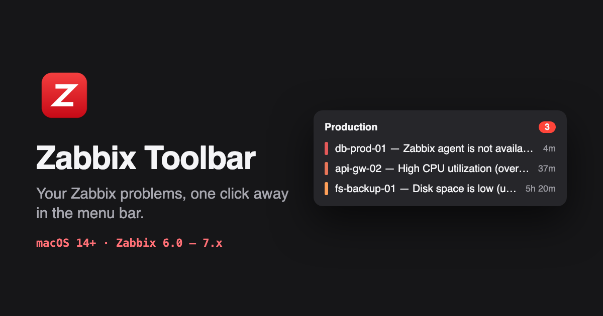

# Zabbix Toolbar

**Your Zabbix problems, one click away in the Mac menu bar.**

Zabbix Toolbar is a native macOS app that watches your Zabbix servers and puts every active problem in the menu bar, with native notifications, quick acknowledgements and nothing to install on the server.

**[zabbixtoolbar.montoanelli.com.br](https://zabbixtoolbar.montoanelli.com.br)** · [Download](https://github.com/alexmontoanelli/zabbix-toolbar-releases/releases/latest/download/ZabbixToolbar.dmg) · [Docs](https://zabbixtoolbar.montoanelli.com.br/docs/) · [FAQ](https://zabbixtoolbar.montoanelli.com.br/faq/) · [Changelog](https://github.com/alexmontoanelli/zabbix-toolbar-releases/releases)

## Features

- **See everything at a glance.** A red "Z" with a count in the menu bar; compact or extended problem list with severity, start time and host groups.
- **Acknowledge without leaving your desk.** Add a message, close the problem, change severity or undo an acknowledgement in Zabbix. *(Pro)*
- **Snooze the noise.** 1 hour, 4 hours, until 8 AM or a custom time. *(Pro)*
- **Alerts that match the severity.** Notification and sound per severity. *(Pro)*
- **All your servers.** Multiple servers *(Pro)*, host group filtering and minimum severity per server *(Pro)*.

## Requirements

- macOS 14 Sonoma or later
- Zabbix 6.0 through 7.x, with an API token or a username and password

## Free and Pro

The Free plan monitors one server with the full problem list and notifications, with no time limit. Pro is $4.99/month or $49.90/year, works on up to 2 Macs, and adds the features marked above. See [pricing](https://zabbixtoolbar.montoanelli.com.br/#pricing).

## Privacy

Nothing about your Zabbix servers leaves your Mac: credentials live in the macOS Keychain and the app talks directly to your Zabbix. Anonymous usage stats can be turned off. Details in the [Privacy Policy](https://zabbixtoolbar.montoanelli.com.br/privacy/).

## Support

Found a bug or something wrong in the docs? [Open an issue](https://github.com/alexmontoanelli/zabbix-toolbar-site/issues). Issues are public: never include server addresses, hostnames, tokens or passwords.

## About this repository

This repository holds the source of the website (built with [Astro](https://astro.build) and published with GitHub Pages). The app itself is distributed as a signed and notarized DMG from [zabbix-toolbar-releases](https://github.com/alexmontoanelli/zabbix-toolbar-releases/releases).

---

Zabbix is a registered trademark of Zabbix SIA. Zabbix Toolbar is an independent product and is not affiliated with or endorsed by Zabbix SIA.
